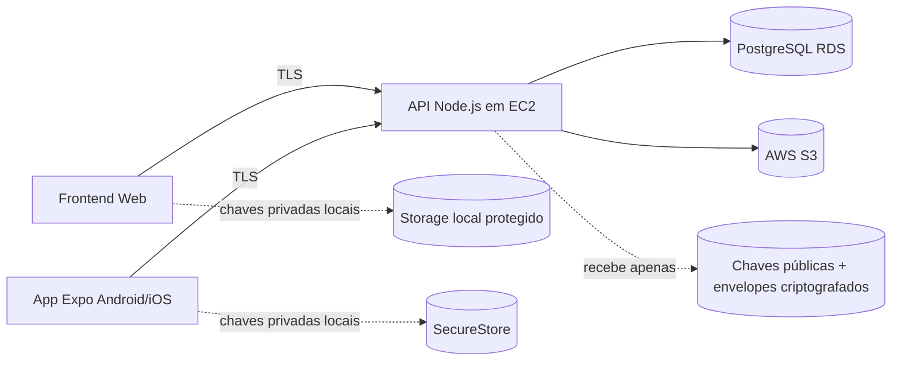

# br-email

MVP de um sistema de e-mail privado com foco extremo em segurança, privacidade e arquitetura zero-knowledge. O projeto entrega backend Node.js, frontend web leve, aplicativo mobile Expo/React Native, banco PostgreSQL e infraestrutura AWS para deploy inicial.

## Visão geral
- **Produto**: sistema de e-mail interno `br-email`
- **Objetivo do MVP**: suporte funcional de autenticação, envio, recebimento e leitura de mensagens criptografadas
- **Plataformas**: Web, Android e iOS
- **Capacidade alvo**: até 1.000 usuários simultâneos no estágio inicial do MVP
- **Regra central**: nenhum operador do servidor consegue ler o conteúdo das mensagens

## Estrutura de pastas
```text
br-email/
├── backend/
├── frontend/
├── mobile/
├── database/
├── infrastructure/
├── docs/
├── security/
├── tests/
├── docker-compose.yml
└── README.md
```

## Arquitetura do sistema


## Como a criptografia funciona
1. Cada dispositivo gera localmente um par de chaves de criptografia e um par de assinatura.
2. O backend recebe apenas as **chaves públicas** e o fingerprint do dispositivo.
3. Ao enviar uma mensagem, o cliente consulta a chave pública do destinatário e criptografa `subject` e `body` antes do envio.
4. A mensagem é assinada pelo remetente para garantir integridade.
5. O backend armazena apenas o envelope criptografado e nunca a mensagem em texto puro.
6. A descriptografia só acontece no dispositivo do usuário com a chave privada local.

## Segurança implementada
- E2EE real com Curve25519/Ed25519
- Zero-knowledge architecture
- Chaves privadas somente no cliente
- Hash de senha com Argon2id
- JWT de acesso + refresh token com hash no banco
- TLS obrigatório em produção
- Proteção contra MITM com fingerprints de chave pública e validação de assinatura
- Política de não logar conteúdo sensível
- Modelo zero trust para o servidor

## Fluxo do sistema
### Registro
1. Cliente gera chaves localmente.
2. Cliente deriva `passwordVerifier`.
3. API salva hash Argon2id do verificador.
4. API registra somente as chaves públicas.

### Login
1. Cliente deriva `passwordVerifier` localmente.
2. API valida Argon2id.
3. API retorna JWT de acesso + refresh token.
4. Cliente desbloqueia sua chave privada localmente.

### Envio de e-mail
1. Cliente busca a chave pública do destinatário.
2. Cliente criptografa assunto/corpo.
3. Cliente assina o envelope.
4. API persiste envelope criptografado.

### Leitura
1. Cliente baixa envelope.
2. Cliente valida assinatura do remetente.
3. Cliente descriptografa localmente.

## Como rodar localmente
### Pré-requisitos
- Node.js 20+
- npm 10+
- Docker + Docker Compose
- Expo CLI / EAS CLI para mobile

### Passo a passo
1. Suba backend + PostgreSQL:
   ```bash
   docker compose up -d --build
   ```
2. Frontend web:
   ```bash
   cd frontend
   npm install
   npm run dev
   ```
3. Backend local fora do Docker (opcional):
   ```bash
   cd backend
   cp .env.example .env
   npm install
   npm run dev
   ```
4. Mobile:
   ```bash
   cd mobile
   npm install
   npm run start
   ```

## Deploy na AWS
### Backend em EC2
1. Provisione a infraestrutura em `infrastructure/terraform`.
2. Instale Node.js, Nginx e PM2 na instância EC2.
3. Configure variáveis de ambiente do backend.
4. Aponte `DATABASE_URL` para o endpoint do RDS.
5. Habilite HTTPS com ACM + ALB ou Nginx + Let's Encrypt.

### Banco em RDS
1. Crie a instância PostgreSQL criptografada.
2. Execute `database/schema.sql`.
3. Restrinja acesso ao security group do backend.

### Frontend e assets
- Frontend pode ser publicado em S3 + CloudFront.
- Anexos futuros podem usar S3 com políticas privadas e URLs temporárias.

### Domínio
- Crie zona no Route 53.
- Configure `api.seudominio.com` para ALB/EC2.
- Configure `app.seudominio.com` para CloudFront/S3.

## Estratégia de escalabilidade para 1.000 usuários
- Backend stateless com possibilidade de múltiplas instâncias atrás de ALB
- Índices específicos em mensagens, sessões e chaves
- RDS com storage criptografado e backups
- Payloads pequenos e limite de taxa por IP
- Separação futura de fila/worker para anexos e notificações

## Limitações do MVP
- Foco em mensagens entre usuários internos do `br-email`
- Sem federação SMTP/IMAP neste estágio
- Sem recuperação de chave privada se o dispositivo for perdido
- Sem anexos E2EE completos neste primeiro corte
- Um diretório simples de chaves por usuário/dispositivo, sem verificação avançada de transparência

## Arquivos importantes
- `backend/src/routes/` — rotas REST
- `frontend/src/crypto/` — criptografia no navegador
- `mobile/src/crypto/` — criptografia no app
- `database/schema.sql` — schema do PostgreSQL
- `security/e2ee.md` — documento detalhado de segurança
- `docs/architecture.md` — arquitetura e diagrama
- `docs/flows.md` — autenticação e envio/recebimento
- `docs/scalability.md` — plano para 1.000 usuários

## Produção recomendada
- Ativar observabilidade sem log de payload sensível
- Usar WAF/Shield na borda
- Adicionar rotação de secrets via AWS Secrets Manager
- Adicionar testes E2E e pipeline CI/CD
