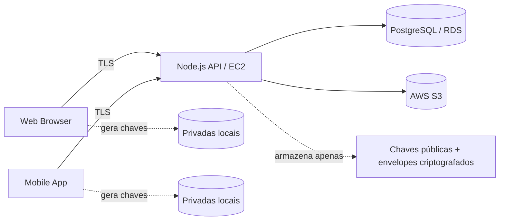

# Arquitetura do sistema

## Princípios
- Zero-knowledge: o servidor não recebe chaves privadas.
- E2EE: subject/body são criptografados no cliente antes do envio.
- Assinatura digital do remetente para integridade do envelope.
- TLS obrigatório em trânsito.
